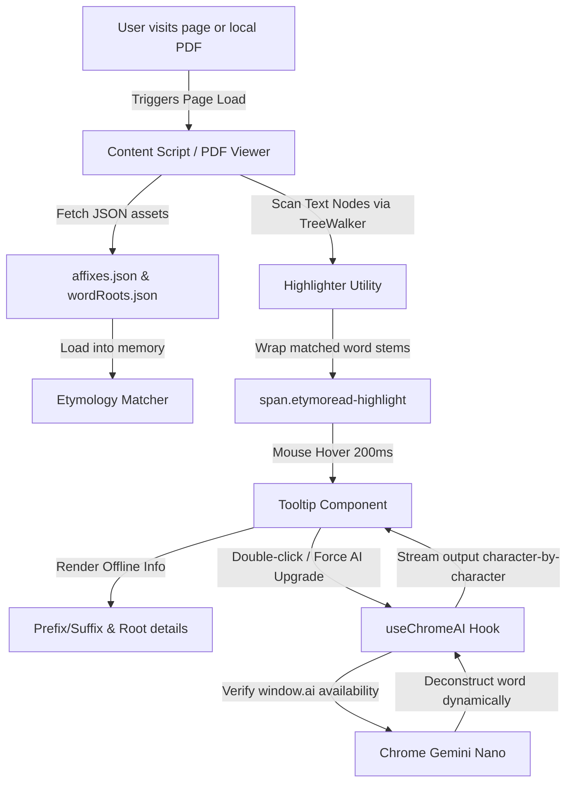

# EtymoRead 🔍📖

An elegant, high-performance, and privacy-first Chrome Extension that highlights English prefixes, suffixes, and word roots (etymology) on web pages and PDFs in real-time, providing interactive tooltips with zero latency. It features optional deep word deconstruction powered by Chrome's local **Gemini Nano AI (`window.ai`)**.

---

## 🌟 Key Features

- **🔍 Real-Time Etymology Highlighting & Tooltips**:
  - Offline database featuring **200+ common prefixes/suffixes** and **400+ key word roots**.
  - Highlights matched words on any web page with an elegant, non-intrusive dotted underline.
  - Displays instant, zero-latency hover tooltips (within 200ms) with structural deconstruction, root meanings, origin languages (e.g., Latin, Greek), and cognates (homologous words).
- **✨ Double-Click Chrome Local AI Analysis**:
  - Leverages Google Chrome 130+'s built-in **Gemini Nano** (`window.ai`) for 100% offline, local generative AI word deconstruction.
  - Generates context-aware, structural breakdowns (prefix + root + suffix) based on the surrounding sentence.
  - Runs entirely on local CPU/GPU hardware with **zero data transmitted over the network** (privacy-first).
- **📄 Native PDF Reader Overhaul**:
  - Intercepts and securely renders local and online PDFs inside the browser via an integrated **PDF.js v4** viewer.
  - Fully supports CJK (Chinese, Japanese, Korean) text layer mapping, enabling word highlighting and double-click local AI lookup directly on PDFs.
  - Enhanced scrolling logic with smooth mousewheel pagination, keyboard controls, and elegant custom scrollbars.
- **⚡ Performance & Architecture Safeguards**:
  - Large static word databases are loaded asynchronously via `fetch` as `.json` runtime assets instead of bundled TS files, avoiding Vite parser out-of-memory (OOM) compilation issues.
  - Built using a hybrid parsing algorithm with dual-direction stripping (prefixes and suffixes) to prevent false matches on short, high-frequency stop-words.

---

## 🛠 Tech Stack

- **Extension Framework**: [WXT](https://wxt.dev/) (Vite-based Next-Gen Web Extension Framework)
- **View Layer**: React 18 & TypeScript (strongly-typed hooks, components, and matchers)
- **Bundler & Compiler**: Vite 6.4 + Rollup
- **PDF Engine**: PDF.js v4.0.379 (Asynchronously loaded as browser ES modules to prevent bundle bloat)
- **Style System**: Vanilla CSS with HSL-tailored variables, Glassmorphism, and smooth micro-animations

---

## 📂 Project Structure

```text
/
├── .wxt/                    # Auto-generated WXT typescript typings & helper files
├── .output/                 # WXT build artifacts (the final Chrome MV3 extension package)
├── assets/                  # Shared style assets
│   └── tooltip.css          # Global styling for underlines and tooltip layout
├── components/              # Shared React components
│   └── Tooltip.tsx          # Floating card rendering, viewport layout boundaries & AI stream controller
├── docs/                    # Technical specifications, user manuals, and assets lists
│   ├── PRD.md               # Product Requirements Document
│   ├── architecture.md      # Detailed system architecture design (in Chinese)
│   ├── user_guide_zh.md     # Chinese User Manual
│   ├── publish_guide_zh.md  # Chrome Extension Publishing Manual (in Chinese)
│   ├── pdf_viewer_troubleshooting_zh.md # PDF viewer issue analysis & solution steps (in Chinese)
│   └── chrome_store_assets_en.md # Store metadata templates, permissions justifications & privacy policy
├── entrypoints/             # Independent extension entrypoints
│   ├── background.ts        # Service worker intercepting/redirecting PDFs
│   ├── content.ts           # Highlights text nodes on normal web pages and orchestrates event listeners
│   ├── pdf-viewer/          # Custom PDF reading application
│   │   ├── index.html       # DOM structure for custom reader
│   │   ├── main.tsx         # Handlers for PDF rendering and highlighting layers
│   │   └── style.css        # PDF reader navigation toolbar and layout theme
│   └── popup/               # Extension popup UI (statistics, settings, toggles)
│       ├── index.html       # Popup window template
│       ├── main.tsx         # Global toggles for highlighting and local AI authorization
│       └── style.css        # Cyberpunk-glassmorphic dark UI dashboard theme
├── hooks/                   # Custom React hooks
│   └── useChromeAI.ts       # Detects and manages window.ai sessions, supporting streaming responses
├── public/                  # Static assets copied directly to build output
│   ├── affixes.json         # 200+ offline prefixes/suffixes dictionary
│   ├── wordRoots.json       # 400+ offline etymology/root dictionary
│   ├── pdf.mjs              # Compiled PDF.js loader
│   ├── pdf.worker.min.mjs   # Multithreaded PDF.js rendering worker
│   └── cmaps/               # Character mapping resource files for CJK PDF rendering
├── utils/                   # Shared utility modules
│   ├── etymologyMatcher.ts  # Logic for peeling prefixes/suffixes and mapping word stems
│   └── highlighter.ts       # DOM TreeWalker for high-performance DOM text wrapping
├── package.json             # Core dependencies and npm script entrypoints
├── tsconfig.json            # TypeScript build rules
└── wxt.config.ts            # WXT configuration (MV3 permissions, manifest headers, vite configuration)
```

---

## 🚀 Getting Started

### Prerequisites

Make sure you have [Node.js](https://nodejs.org/) (v18+) and [pnpm](https://pnpm.io/) installed.

### Installation

1. Clone this repository:
   ```bash
   git clone https://github.com/haibing-wang/EtymoRead.git
   cd EtymoRead
   ```

2. Install dependencies:
   ```bash
   pnpm install
   ```

### Development

Run the development server. WXT will automatically open a clean Chrome instance containing your extension. It supports Hot Module Replacement (HMR) and automatically re-compiles when you make code changes:

```bash
pnpm dev
```

### Production Build

To compile a production-ready package:

```bash
pnpm build
```

This compiles your extension code to `.output/chrome-mv3/`.

To package the built files into a `.zip` archive for Chrome Web Store submission:

```bash
pnpm zip
```

The resulting zip file will be saved at `.output/chrome-mv3.zip`.

---

## 🧬 Architecture Flow



---

## 🔒 Chrome Local AI Setup Guide

If the extension displays a `No Local AI Detected` warning on the dashboard or hover tooltips, you need to enable the developer experimental flags in your browser:

1. **Verify Version**: Ensure you are using **Google Chrome version 130 or higher**.
2. **Enable On-Device Model Optimization**:
   - Go to `chrome://flags`
   - Search for `#optimization-guide-on-device-model` (or `Enables optimization guide on device model`).
   - Change the option from *Default* to **Enabled BypassPrefRequirement** (this bypasses battery and disk-space checks to force activation).
3. **Enable Prompt API**:
   - Search for `#prompt-api-for-gemini-nano` (or `Prompt API for Gemini Nano`).
   - Set it to **Enabled**.
4. **Relaunch Browser**: Click **Relaunch** in the bottom-right corner of Chrome.
5. **Download the Weights**:
   - After restarting Chrome, navigate to `chrome://components`.
   - Find **Optimization Guide On Device Model**.
   - Click **Check for update** to begin downloading the Gemini Nano weights (approx. 1.5 - 3 GB).
   - Once it displays **Up-to-date**, Chrome's local AI is active.
6. Open the EtymoRead popup window and toggle **Enable Local AI on Double-Click**.

---

## 📜 License

This project is open-source and available under the [MIT License](LICENSE). All database assets are free to use and read offline.
