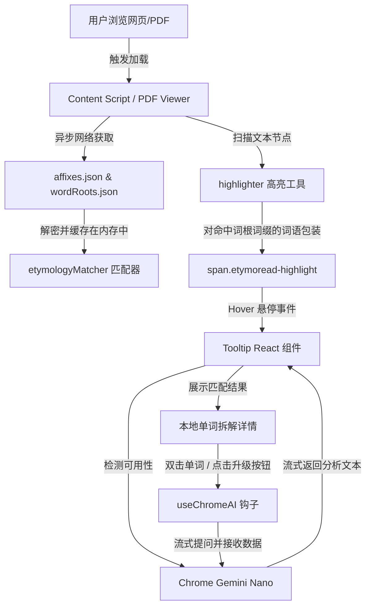

# EtymoRead 项目架构文档

EtymoRead 是一款基于 **WXT + React 18 + TypeScript + Vite 6** 开发的 Chrome 浏览器扩展。它能够在用户阅读网页或 PDF 文件时，离线高亮识别约 200 个常见英文前缀/后缀与 400 个常用词根，并提供浮动卡片展示逻辑拆解。此外，它支持调用 Chrome 130+ 的本地 Gemini Nano AI (`window.ai`) 进行双击深度单词拆解。

---

## 1. 技术栈与技术特性

- **前端框架**: React 18 (使用 React Hooks 管理内部状态，ReactDOM 处理内容注入)
- **编译/构建工具**: Vite 6.4 + Rollup + WXT (支持 Manifest V3)
- **脚本语言**: TypeScript (类型安全，全链路无隐式 `any`)
- **PDF 渲染引擎**: PDF.js v4.0.370 (以原生浏览器 ES Module 异步引入，减少 Vite 编译期内存和性能开销)
- **CSS 风格**: Vanilla CSS (极简、高性能的原生样式，结合 Glassmorphism 毛玻璃与微动效)

---

## 2. 目录结构

```text
/
├── .wxt/                    # WXT 编译期自动生成的类型声明与配置目录
├── .output/                 # WXT 构建打包后生成的扩展目录（chrome-mv3）
├── assets/                  # 静态公共资源，包含样式等
│   └── tooltip.css          # 高亮字词与浮动 Tooltip 的全局样式
├── components/              # 共享 React 组件
│   └── Tooltip.tsx          # 悬浮词根词缀展示与 AI 交互控制核心组件
├── docs/                    # 各种文档目录
│   ├── PRD.md               # 需求设计文档
│   ├── prompt_init.md       # 工程初始化与指令文档
│   └── architecture.md      # [本文件] 项目架构文档
├── entrypoints/             # 扩展各个独立入口模块
│   ├── background.ts        # 后台 Service Worker（处理重定向与缓存清理）
│   ├── content.ts           # 注入页面中的网页单词匹配与事件监听脚本
│   ├── pdf-viewer/          # 自定义 PDF 浏览器入口
│   │   ├── index.html       # PDF 渲染容器页面
│   │   ├── main.tsx         # 渲染 PDF 页面、生成文字层并高亮的核心 React 逻辑
│   │   └── style.css        # 自定义 PDF 浏览器的工具栏与页面布局样式
│   └── popup/               # 点击扩展图标弹出的设置与统计面板
│       ├── index.html       # 设置面板 HTML 页面
│       ├── main.tsx         # 词根词缀开关、AI 开启控制与高亮统计面板
│       └── style.css        # 现代暗色玻璃质感控制面板样式
├── hooks/                   # 自定义 React Hooks
│   └── useChromeAI.ts       # 封装 Chrome Gemini Nano (window.ai) 的检测与流式 Prompt 调用
├── public/                  # 静态资源根目录（直接复制到构建根目录）
│   ├── affixes.json         # 200+ 离线前缀与后缀 JSON 数据库
│   ├── wordRoots.json       # 400+ 离线词根与源流 JSON 数据库
│   ├── pdf.mjs              # PDF.js 主包的浏览器 ES 模块版
│   └── pdf.worker.min.mjs   # PDF.js 多线程渲染 Worker 包
├── utils/                   # 独立工具函数集
│   ├── etymologyMatcher.ts  # 词根词缀解析匹配器（前/后缀剥离、同源词匹配）
│   └── highlighter.ts       # 高效 DOM 遍历与文本字词高亮包装工具
├── package.json             # 依赖管理与快捷指令配置
├── tsconfig.json            # 继承 .wxt 的项目 TypeScript 配置文件
└── wxt.config.ts            # WXT 核心配置文件（DNR 权限、静态路径导出等）
```

---

## 3. 系统核心架构与模块交互



### 3.1 PDF 重定向机制 (Background Service Worker)
为了对 PDF 进行高亮和取词分析，项目禁用了 Chrome 默认的 PDF 查看器，采用 DNR (Declarative Net Request) 与 `webNavigation` 相结合的方式重定向到本扩展内置的自定义渲染引擎：
1. **DNR 规则配置**: 拦截所有以 `.pdf` 结尾的 `http/https` 请求，重定向至本地的 `pdf-viewer.html?pdf=<original_url>`。
2. **本地文件监听 (`file://`)**: 监听 `webNavigation.onBeforeNavigate`，若遇到 `file://` 协议的本地 PDF 导航，使用 `chrome.tabs.update` 重定向至本地的 `pdf-viewer.html?pdf=encodeURIComponent(<file_path>)`。

### 3.2 词根字词高亮算法 (Highlighter & Matcher)
为了在数万字的网页或 PDF 渲染图层中实现高性能高亮：
1. **DOM TreeWalker 扫描**: 使用原生 `document.createTreeWalker`，仅收集属于 `NodeFilter.SHOW_TEXT` 且祖先元素不含 `SCRIPT` / `STYLE` / `IFRAME` / `PRE` 等非阅读标签的纯文本节点。
2. **词法拆解 (Peeling) 匹配**:
   - 提取至少三位的连续英文字母作为待查候选词。
   - 利用倒序长度排列的前缀和后缀词库进行最多两层的剥离（如 `prehistory` 剥离 `pre-` 得到 `history`）。
   - 将剩余的词干（Stem）与词根数据库进行模糊前缀/子串匹配（如 `hydr` 匹配 `hydro`）。
   - 返回匹配的前后缀、词根、同源词与英文源流。
3. **安全替换**: 为命中字词封装 `<span class="etymoread-highlight" data-etymo-word="word">` 并应用虚线下划线，使用 DocumentFragment 完成高性能 DOM 原生节点替换。

### 3.3 本地 Gemini Nano AI 交互机制 (useChromeAI)
1. **可用性自检**: 异步检测全局对象 `window.ai` 及其子对象 `window.ai.languageModel` 或 `window.ai.assistant`，解析其 capabilities 状态。
2. **流式分析封装**: 
   - 设定简洁专业中文返回 prompt 约束（约束在 120 字内，要求按特定结构输出 `【词根词缀】` 与 `【源流释义】`）。
   - 传递双击选中词与周围语句上下文，让 AI 结合上下文做句意单词拆解。
   - 利用 `for await (const chunk of session.promptStreaming(...))` 接收流式生成并在卡片中以打字机特效实时渲染。

---

## 4. 关键问题与构建配置优化

项目在开发过程中克服了若干严重的 Vite 构建性能与 TypeScript 内存泄漏问题：

### 4.1 大文件静态化与运行时拉取 (OOM 修复 1)
- **原因**: 初始将 200 个前后缀与 400 个词根的大量静态数组定义在 `.ts` 代码中，导致 Vite 编译期的语法树分支爆炸，耗尽 Node.js 内存。
- **优化**: 转换为标准的离线 `.json` 数据集存放在 `/public` 中，在运行时通过 `chrome.runtime.getURL` 和 `fetch` 动态读入内存并常驻，完全剥离了 Vite 编译依赖。

### 4.2 PDF.js 异步解耦与编译隔离 (OOM 修复 2)
- **原因**: 直接在 React 依赖链中 `import` 大小超过 3MB 的 `pdfjs-dist`，导致 Rollup 内存占用过载，且内部的 Node/Web 环境污染使得 Service Worker 编译失效。
- **优化**: 去除第三方 npm 编译依赖，将预编译的 `pdf.mjs` 和 `pdf.worker.min.mjs` 作为原生 ES 模块存入 `public/` 中。在 `index.html` 中通过 `<script type="module">` 引入并将类挂载到 `window.pdfjsLib` 上，React 代码中通过 `any` 类型强制读取，完全脱离构建工具的解析。
- 在 `wxt.config.ts` 中使用 `build.rollupOptions.external: ['/pdf.mjs']`，确保 Vite 编译不会报错，并作为外部资源处理。

### 4.3 依赖版本兼容 (Vite 6 升级修复)
- **原因**: WXT 默认会将依赖的 `vite-node` 安装为 `v6.0.0` (兼容 Vite v6)，但若项目根目录 `package.json` 中的 `vite` 仍被限制为 `^5.2.11`，会在 `wxt prepare` 与 `wxt build` 调用 `vite-node` 预执行 entrypoints 时，因为 API 版本错位导致陷入无限的转换 reload 环路（表现为 transforms 无限重复，最终 pipe 满溢导致线程挂起）。
- **优化**: 将 `package.json` 中的 `"vite"` 版本提升至 `^6.0.0`（统一为 Vite v6 和 ViteNode v6），彻底解除了该冲突，编译效率提升至毫秒级。
