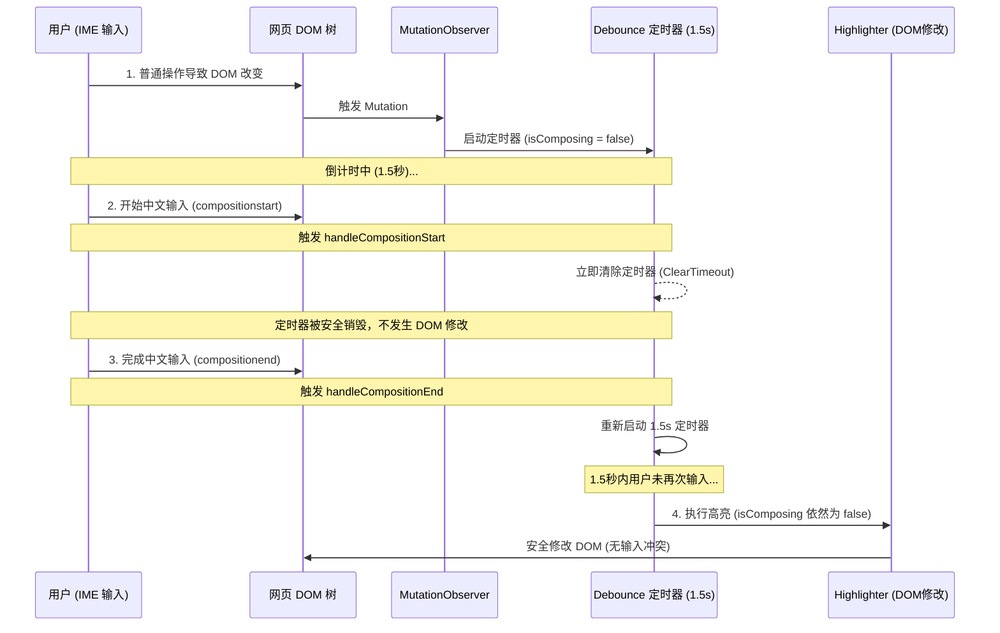

# EtymoRead 中文输入（IME）中断与乱序问题分析与解决步骤总结

在 Chrome 浏览器扩展开发中，如果 Content Script 对 DOM 进行动态扫描和修改（例如本插件的词根词缀高亮 `highlightDOM`），极易与用户的输入法（IME，特别是中文、日文等需要拼音/假名组字的过程）产生冲突。

本篇文档旨在总结该问题的现象、深层原因以及对应的解决步骤，作为后续开发和维护的防坑指南。

---

## 问题现象

当用户在网页的输入框（特别是 `contenteditable` 容器、动态搜索框或含有字符计数的输入框）中使用中文输入法打字时：
1. **输入突然中断**：打字过程被截断，拼音组字窗口（Composition Window）强行关闭。
2. **文本乱序/Scrambled**：输入框中遗留下未完成组字的拼音英文字母与已确认的汉字混杂在一起（例如输入 `wenti` 本应输出 `问题`，却变成了 `wen题` 或 `wenti问题`）。

---

## 深层原因分析

### 1. 动态扫描机制与 IME 状态冲突
为了在单页应用（SPA）或动态加载的网页中实时高亮词根，插件在 `entrypoints/content.ts` 中注册了一个全局 `MutationObserver` 监听 DOM 树的变化。

每当 DOM 发生变化时，会调用 `triggerScan()` 函数，延时 1.5 秒（debounce）后执行 `highlightDOM(document.body)`。

### 2. 定时器竞态漏洞（Race Condition）
原先的代码虽然通过 `isComposing` 变量试图在 IME 输入期间拦截 DOM 修改，但存在以下两个致命漏洞：

#### 漏洞 A：定时器执行时未校验最新状态
`triggerScan()` 的原逻辑如下：
```typescript
const triggerScan = () => {
  if (isInvalidated) return;
  if (isComposing) return; // 1. 在这里拦截了
  if (debounceTimer) clearTimeout(debounceTimer);
  debounceTimer = setTimeout(() => {
    if (isInvalidated) return;
    const count = highlightDOM(document.body); // 2. 但 1.5秒后执行时，未校验 isComposing！
    ...
  }, 1500);
};
```
*   **场景**：页面先发生了一次普通 DOM 变动（此时 `isComposing` 为 `false`），触发并启动了 1.5 秒的定时器。
*   **冲突**：在接下来的 1.5 秒内，用户开始敲击键盘使用中文输入（`compositionstart` 触发，`isComposing` 变为 `true`）。
*   **爆发**：1.5 秒时间到，定时器回调执行。由于回调内部**没有**校验 `isComposing`，它强行调用了 `highlightDOM(document.body)`。DOM 节点的替换破坏了正在输入的内容，导致 IME 中断并留下乱序拼音。

#### 漏洞 B：连续输入时未及时清理历史定时器
当用户打完第一个中文字词时，触发 `compositionend`：
1. `isComposing` 设为 `false`。
2. 调用 `triggerScan()`，启动 1.5 秒定时器。

如果用户动作很快，在 1.5 秒内又开始输入第二个词：
1. 触发 `compositionstart`，`isComposing` 重新变为 `true`。
2. **问题**：原先的 `handleCompositionStart` **没有清理**上一个词结束后留下的 1.5 秒定时器！
3. **结果**：上一次的定时器在用户正在输入第二个词的中途爆发，导致第二次输入被无情中断。

---

## 解决步骤

为了彻底解决上述竞态问题，我们在 Content Script 中实施了**组合防护（IME Lock & Clear）**：

### 1. 开始输入时，立即强行清理定时器
当监听到 `compositionstart` 事件时，不仅将 `isComposing` 设为 `true`，还必须**立即清理并销毁**任何正在倒计时的高亮扫描定时器。
```diff
     const handleCompositionStart = () => {
       isComposing = true;
+      if (debounceTimer) {
+        clearTimeout(debounceTimer);
+        debounceTimer = null;
+      }
     };
```

### 2. 定时器回调中，增加最终防御校验
在 `setTimeout` 回调函数真正执行 `highlightDOM` 前，再次核对当前的 `isComposing` 状态。如果用户此时处于输入中，则放弃此次高亮操作。
```diff
     debounceTimer = setTimeout(() => {
       if (isInvalidated) return;
+      if (isComposing) return; // 定时器触发时的安全拦截
       const count = highlightDOM(document.body);
       ...
     }, 1500);
```

### 3. 拦截流程图



---

## 总结与建议

在编写任何会对页面 DOM 进行**增删改**的 Chrome 扩展 Content Script 时，必须牢记以下原则：
1. **时刻关注 `isComposing` 状态**：一旦用户处于 IME 组字输入状态，**绝对不要**对 DOM 进行任何修改。
2. **异步操作与定时器的双重校验**：在所有 `setTimeout`、`requestAnimationFrame` 或 `Promise.then` 回调中，凡是涉及 DOM 操作的，执行前都必须做 `isComposing` 与 `isInvalidated` 的最新状态校验。
3. **输入期阻断**：不仅要通过事件拦截新的定时器，更要在 `compositionstart` 时主动清理历史遗留的挂起（Pending）定时器。
